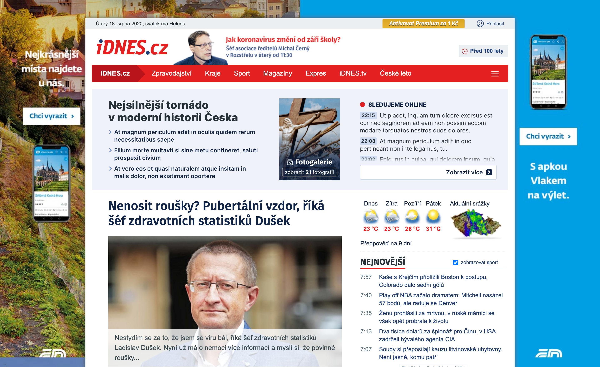

# MEGOVKA FAST

Referenční úkol pro výběrové řízení HTML/CSS kodér.

- [Zadání](#Zadání)
- [Rozsah a realizace](#Rozsah-a-realizace)
- [Vlastní přínos](#Vlastní-přínos)

## Zadání
Nakódovat dodaný segment stránky (dále jen box), podle zadání v podobě grafického návrhu vyexportovaného v módu pro vývojáře z Invision. Jedná se o světle podbarvený box "Nejsilnější tornádo..." bez ohledu zbytku (okolí) stránky.
Výstupem bude ZIP soubor, ve kterém bude: HTML, CSS i všechny případné soubory.

Screenshot grafického návrhu stránky najdete na *[desktop-design.png](./design/desktop-design.png)*

## Rozsah a realizace

Stručný výčet znalostí, které jsem v úkolu využila.

- rozvržení layoutu webu CSS **flexboxem**
- jednotky pro tvorbu webu (**em**, **rem**, **%**, **px**)
- pojmenování CSS tříd metodikou **BEM**
- organizace a rozdělení CSS za pomocí **Sass** - zanořování
- SVG ikony v externím **SVG sprite**
- **JavaScript EventListener** na odkazy pro jednotlivé sekce
- uložení souborů v repozitáři na **GitHub** a jeho publikování na **GitHub Pages**

## Vlastní přínos

Mé doporučení dalšího možného využití současného řešení v praxi.

- **pořadí jednotlivých sekcí** lze změnit pomocí vlastnosti `order` (vycházející z `display: flex`)
- **obarvení SVG ikon** přes vlastnost `fill`
- **odkazy jednotlivých sekcí** lze bez použití JavaScriptu omezit na buttony
- **barvu pozadí boxu** lze upravit přes vlastnost `background-color` v případě nenačtení obrázku na pozadí (vlastnost `background-image`)